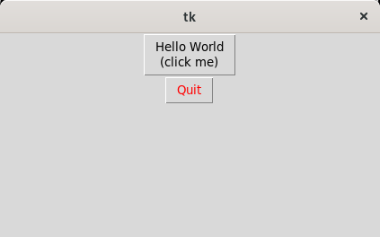

# Python3 GUI Programming with Tkinter(Tutorial 004) - Window with checkbutton

The **Pack** geometry manager packs widgets in rows or columns. You can use options 
like fill, expand, and side to control this geometry manager.

    #!/usr/bin/python
    import tkinter as tk

    class Application(tk.Frame):
    def __init__(self, master=None):
        super().__init__(master)
        self.master = master
        self.pack()
        self.create_widgets()

    def create_widgets(self):
        self.hi_there = tk.Button(self)
        self.hi_there ["text"]="Hello World\n(click me)"
        self.hi_there["command"]=self.say_hi
        self.hi_there.pack(side='top')

        self.quit =tk.Button(self, text='Quit', fg="red",
                             command=self.master.destroy)

        self.quit.pack(side="bottom")

    def say_hi(self):
        print("hi there, everyone!")

    root=tk.Tk()
    app = Application(master=root)
    app.mainloop()
				
